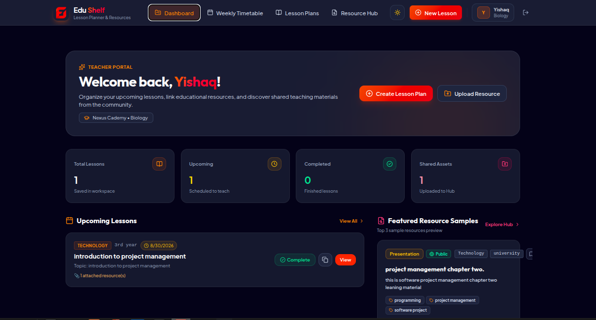
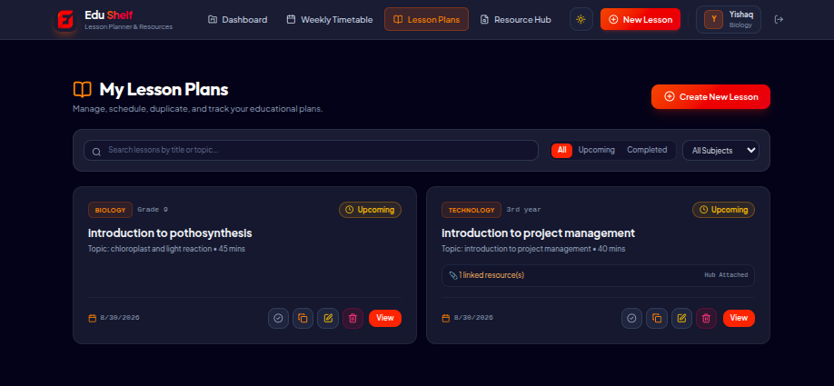
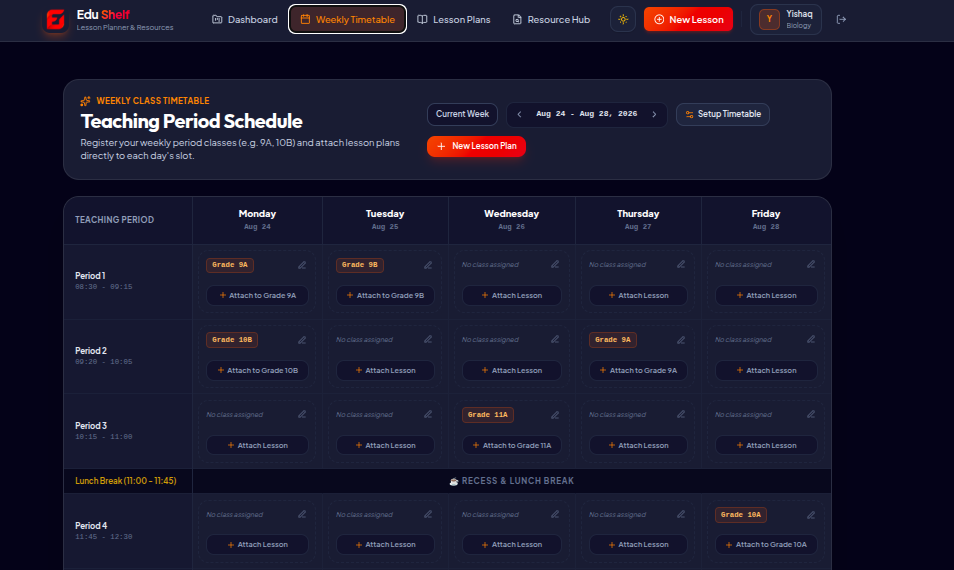
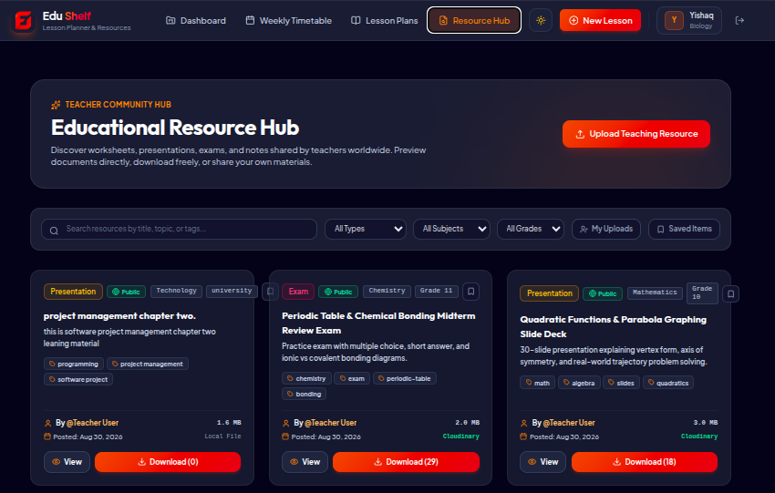

# 🎓 EduShelf — Modern Teacher Lesson Planner & Resource Hub

[](https://opensource.org/licenses/MIT)
[](https://react.dev/)
[](https://tailwindcss.com/)

**EduShelf** is an all-in-one full-stack web application designed for modern educators. It streamlines lesson planning, schedule management, document sharing, and resource analytics into a sleek, responsive workspace.

---

## 📸 Platform Screenshots & Visual Tour

### 1. Teacher Dashboard
*Aggregates overall teaching statistics, weekly lesson summaries, downloadable resource highlights, and quick action shortcuts.*


---

### 2. Comprehensive Lesson Plan Manager
*Draft, organize, search, filter, and print/export structured lesson plans with objectives, learning standards, and attached materials.*


---

### 3. Interactive Weekly Timetable
*Manage your weekly teaching schedule with subject color indicators, time slots, room numbers, and status tracking.*


---

### 4. Community Resource Hub
*Discover, preview, download, and bookmark educational materials (worksheets, presentations, exams, notes) shared by fellow teachers.*


---

## ✨ Key Features

- **📅 Interactive Teaching Timetable**: Organize weekly class schedules with subject badges, grade levels, classroom locations, and time slots.
- **📝 Lesson Plan Authoring & PDF Export**: Create rich lesson plans with objectives, main activities, assessment strategies, homework, and instant PDF print/export capabilities.
- **📚 Community Resource Hub**: Browse, upload, filter, and preview worksheets, exams, notes, and slide decks.
- **👁️ Document Previewer**: Built-in modal viewer for inline document inspection without forced downloads.
- **🔖 Saved Items & Bookmarks**: Favorite teaching materials for quick access from your personalized workspace.
- **📊 Material Download Analytics**: Track total downloads, portfolio reach, and material leaderboard directly from your profile.
- **🔐 Secure Authentication**: Powered by Better-Auth with encrypted sessions, email/password authentication, and protected routes.
- **🎨 Glassmorphism Dark UI**: Designed with TailwindCSS v4, custom glass panels, micro-animations, and mobile responsiveness.

---

## 🛠️ Technology Stack

### Frontend (`/client`)
- **Core**: React 19, TypeScript, Vite
- **Styling**: TailwindCSS v4, Lucide Icons, Custom Glassmorphism CSS
- **State & Routing**: React Router v7, Custom AuthContext
- **Feedback & Utilities**: React Hot Toast, Axios

### Backend (`/server`)
- **Server Framework**: Node.js, Express 5, TypeScript
- **Database**: MongoDB Atlas, Mongoose ODM
- **Auth System**: Better-Auth (with MongoDB adapter)
- **File Storage**: Cloudinary API & Local Disk Upload fallback (Multer)

---

## 📁 Repository Structure

```
Teacher Lesson Planner/
├── client/                     # Vite + React Frontend
│   ├── src/
│   │   ├── assets/            # Official brand assets & logos
│   │   ├── components/        # Reusable UI components (Navbar, Footer, ResourceCard, etc.)
│   │   ├── context/           # AuthContext & ThemeContext
│   │   ├── lib/               # API & Auth client utilities
│   │   ├── pages/             # Page components (Dashboard, Lessons, Hub, Profile, etc.)
│   │   ├── types/             # TypeScript definitions
│   │   └── index.css          # Core CSS tokens & Tailwind styles
│   └── package.json
├── server/                     # Node.js + Express Backend
│   ├── src/
│   │   ├── config/            # Database & Better-Auth configuration
│   │   ├── models/            # Mongoose schemas (User, LessonPlan, Resource, Timetable)
│   │   ├── routes/            # REST API endpoint handlers
│   │   └── server.ts          # Express entry point
│   └── package.json
├── publicAsset/               # Application UI Screenshots
└── README.md
```

---

## 🚀 Quick Start Guide (Local Setup)

### Prerequisites
- **Node.js** (v18.x or higher)
- **npm** (v9.x or higher)
- **MongoDB Atlas** database URI (or local MongoDB running on `mongodb://localhost:27017`)

---

### 1. Server Setup (`/server`)

```bash
# Navigate to the server folder
cd server

# Install dependencies
npm install

# Create environment configuration file
cp .env.example .env   # Or create .env manually
```

Configure your `server/.env` file:
```env
PORT=5000
MONGODB_URI=mongodb+srv://<username>:<password>@cluster.mongodb.net/edushelf?retryWrites=true&w=majority
BETTER_AUTH_SECRET=your_super_secret_auth_key_32_chars
CLIENT_URL=http://localhost:5173

# Optional: Cloudinary Storage
CLOUDINARY_CLOUD_NAME=your_cloud_name
CLOUDINARY_API_KEY=your_api_key
CLOUDINARY_API_SECRET=your_api_secret
```

Start the development backend server:
```bash
npm run dev
```
The server will start running on **`http://localhost:5000`**.

---

### 2. Client Setup (`/client`)

Open a new terminal window:
```bash
# Navigate to the client folder
cd client

# Install dependencies
npm install

# Create environment configuration file
cp .env.example .env   # Or create .env manually
```

Configure your `client/.env` file:
```env
VITE_API_URL=http://localhost:5000
```

Start the frontend development server:
```bash
npm run dev
```
The client app will open at **`http://localhost:5173`**.

---

## 🌐 Deployment Instructions

### Backend Deployment (Render)
1. Create a **Web Service** on Render pointing to the `/server` directory.
2. Set **Build Command**: `npm install && npm run build`
3. Set **Start Command**: `npm run start`
4. Set Environment Variables on Render:
   - `MONGODB_URI`: Your MongoDB Atlas URI
   - `CLIENT_URL`: `https://your-frontend.vercel.app`
   - `BETTER_AUTH_URL`: `https://your-backend.onrender.com`
   - `BETTER_AUTH_SECRET`: Random 32+ character string

### Frontend Deployment (Vercel / Netlify / Render Static)
1. Deploy the `/client` directory to Vercel.
2. Set **Build Command**: `npm run build`
3. Set **Output Directory**: `dist`
4. Add Environment Variable in Vercel:
   - `VITE_API_URL`: `https://your-backend.onrender.com`

---

## 📄 License

This project is open-source and available under the [MIT License](LICENSE).
